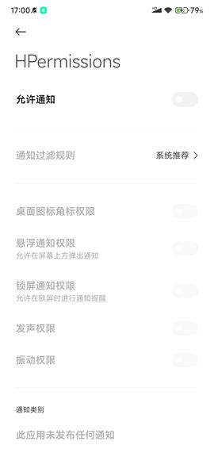

# 权限请求框架

* [点击此处下载Demo](HPermissions.apk)，[博客地址](https://www.jianshu.com/u/37d88b909f3b)

  
  

####使用方式
引用
1、在根目录的build.gradle中加入如下配置
```
allprojects {
   repositories {
	...
	maven { url 'https://jitpack.io' }
   }
}
```
2、在要是用的module中增加如下引用
```groovy
dependencies {
    // 权限请求框架
   implementation 'com.github.dahui888:HPermissions:v1.1'
}
```

#### 一句代码搞定权限请求，从未如此简单

```java
HPermissions.with(this)
        // 申请安装包权限
        //.permission(Permission.REQUEST_INSTALL_PACKAGES)
        // 申请悬浮窗权限
        //.permission(Permission.SYSTEM_ALERT_WINDOW)
        // 申请通知栏权限
        //.permission(Permission.NOTIFICATION_SERVICE)
        // 申请系统设置权限
        //.permission(Permission.WRITE_SETTINGS)
        // 申请单个权限
        .permission(Permission.RECORD_AUDIO)
        // 申请多个权限
        .permission(Permission.Group.CALENDAR)
        .request(new OnPermission() {

            @Override
            public void hasPermission(List<String> granted, boolean all) {
                if (all) {
                    toast("获取录音和日历权限成功");
                } else {
                    toast("获取部分权限成功，但部分权限未正常授予");
                }
            }

            @Override
            public void noPermission(List<String> denied, boolean never) {
                if (never) {
                    toast("被永久拒绝授权，请手动授予录音和日历权限");
                    // 如果是被永久拒绝就跳转到应用权限系统设置页面
                    HPermissions.startPermissionActivity(MainActivity.this, denied);
                } else {
                    toast("获取录音和日历权限失败");
                }
            }
        });
```
#### 从系统权限设置页返回判断

```java
public class XxxActivity extends AppCompatActivity {

    @Override
    protected void onActivityResult(int requestCode, int resultCode, @Nullable Intent data) {
        super.onActivityResult(requestCode, resultCode, data);
        if (requestCode == HPermissions.REQUEST_CODE) {
            if (HPermissions.hasPermission(this, Permission.RECORD_AUDIO) &&
                    HPermissions.hasPermission(this, Permission.Group.CALENDAR)) {
                toast("用户已经在权限设置页授予了录音和日历权限");
            } else {
                toast("用户没有在权限设置页授予权限");
            }
        }
    }
}
```

#### 关于权限监听回调参数说明

* 我们都知道，如果用户全部授予只会调用 `hasPermission` 方法，如果用户全部拒绝只会调用 `noPermission` 方法。

* 但是还有一种情况，如果在请求多组权限的情况下，这些权限不是被全部授予或者全部拒绝了，而是部分授权部分拒绝这种情况，框架会如何处理回调呢？

* 框架会先调用 `noPermission` 方法，再调用 `hasPermission` 方法。其中我们可以通过 `hasPermission` 方法中的 `all` 参数来判断权限是否全部授予了。

* 如果想知道回调中的某个权限是否被授权或者拒绝，可以调用 `List` 类中的 `contains(Permission.XXX)` 方法来判断这个集合中是否包含了这个权限。


#### Android 11 定位权限适配

* 在 Android 10 上面，定位被划分为前台权限（精确和模糊）和后台权限，而到了 Android 11 上面，需要分别申请这两种权限，如果同时申请这两种权限会惨遭系统无情拒绝，连权限申请对话框都不会弹，直接被系统拒绝，导致定位权限申请失败。

* 如果你使用的是 HPermissions 最新版本，那么恭喜你，直接将前台定位权限和后台定位权限全部传给框架即可，框架已经自动帮你把这两种权限分开申请了，整个适配过程零成本。

#### Android 11 存储权限适配

* 如果你的项目需要适配 Android 11 存储权限，那么需要先将 targetSdkVersion 进行升级

```groovy
android 
    defaultConfig {
        targetSdkVersion 30
    }
}
```

* 再添加 Android 11 存储权限注册到清单文件中

```xml
<uses-permission android:name="android.permission.MANAGE_EXTERNAL_STORAGE" />
```

* 需要注意的是，旧版的存储权限也需要在清单文件中注册，因为在低于 Android 11 的环境下申请存储权限，框架会自动切换到旧版的申请方式

```xml
<uses-permission android:name="android.permission.READ_EXTERNAL_STORAGE" />
<uses-permission android:name="android.permission.WRITE_EXTERNAL_STORAGE" />
```

* 还需要在清单文件中加上这个属性，否则在 Android 10 的设备上将无法正常读写外部存储上的文件

```xml
<application
    android:requestLegacyExternalStorage="true">
```
    
* 最后直接调用下面这句代码

```java
HPermissions.with(MainActivity.this)
        // 不适配 Android 11 可以这样写
        //.permission(Permission.Group.STORAGE)
        // 适配 Android 11 需要这样写，这里无需再写 Permission.Group.STORAGE
        .permission(Permission.MANAGE_EXTERNAL_STORAGE)
        .request(new OnPermission() {

            @Override
            public void hasPermission(List<String> granted, boolean all) {
                if (all) {
                    toast("获取存储权限成功");
                }
            }

            @Override
            public void noPermission(List<String> denied, boolean never) {
                if (never) {
                    toast("被永久拒绝授权，请手动授予存储权限");
                    // 如果是被永久拒绝就跳转到应用权限系统设置页面
                    HPermissions.startPermissionActivity(MainActivity.this, denied);
                } else {
                    toast("获取存储权限失败");
                }
            }
        });
```

#### 框架亮点

* 第一款适配 Android 11 的权限请求框架，适配过程几乎零成本

* 简洁易用，采用链式调用的方式，使用只需一句代码

* 支持单个权限、多个权限、单个权限组、多个权限组请求

* 支持申请安装包、悬浮窗、通知栏、系统设置权限

* 支持所有危险权限的申请，包含 6.0 之后出现的新权限

* 向下兼容属性，新权限在旧系统可以正常申请，无需调用者适配

* 本框架不依赖任何第三方库，整个框架大小不到 20 kb（在同类框架中排名第一）

* 如果申请的权限没有在清单文件中注册会抛出异常（仅在 Debug 模式下判断）

* 如果申请的权限和项目 targetSdkVersion 不符合要求会抛出异常（仅在 Debug 模式下判断）

#### 为什么不兼容 Android 6.0 以下的权限申请？

* 因为 Android 6.0 以下的权限管理是手机厂商做的，那个时候谷歌还没有统一权限管理的方案，所以就算我们的应用没有适配也不会有任何问题，因为手机厂商对这块有自己的处理，但是有一点是肯定的，就算用户拒绝了授权，也不会导致应用崩溃，只会返回空白的通行证。

* 如果 HPermissions 做这块的适配也可以做到，通过反射系统服务 AppOpsManager 类中的字段即可，但是并不能保证权限判断的准确性，可能会存在一定的误差，其次是适配的成本太高，因为国内手机厂商太多，对这块的改动参差不齐。

* 考虑到 Android 6.0 以下的设备占比很低，后续也会越来越少，会逐步退出历史的舞台，所以我的决定是不对这块做适配。

## License

```text
Copyright 2020 Pan Hui

Licensed under the Apache License, Version 2.0 (the "License");
you may not use this file except in compliance with the License.
You may obtain a copy of the License at

   http://www.apache.org/licenses/LICENSE-2.0

Unless required by applicable law or agreed to in writing, software
distributed under the License is distributed on an "AS IS" BASIS,
WITHOUT WARRANTIES OR CONDITIONS OF ANY KIND, either express or implied.
See the License for the specific language governing permissions and
limitations under the License.
```
